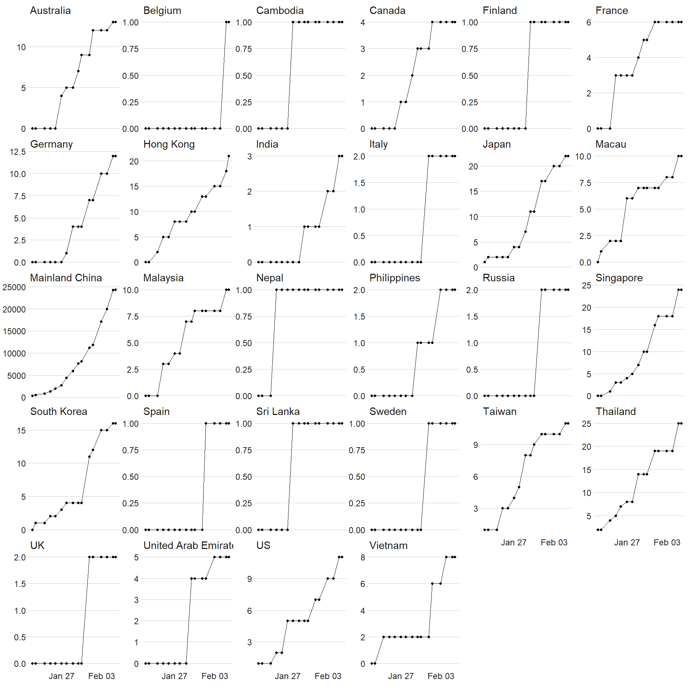
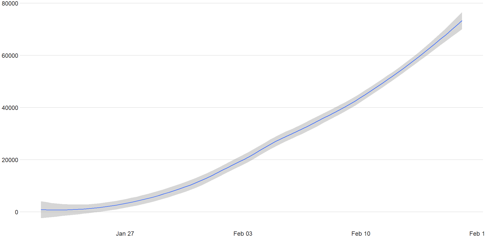

    ## # A tibble: 65 x 29
    ##    `Province/State` `Country/Region` `First confirme~   Lat  Long
    ##    <chr>            <chr>            <chr>            <dbl> <dbl>
    ##  1 Anhui            Mainland China   1/3/2020          31.8  117.
    ##  2 Beijing          Mainland China   1/3/2020          40.2  116.
    ##  3 Chongqing        Mainland China   1/3/2020          30.1  108.
    ##  4 Fujian           Mainland China   1/3/2020          26.1  118.
    ##  5 Gansu            Mainland China   1/3/2020          36.1  104.
    ##  6 Guangdong        Mainland China   1/3/2020          23.3  113.
    ##  7 Guangxi          Mainland China   1/3/2020          23.8  109.
    ##  8 Guizhou          Mainland China   1/3/2020          26.8  107.
    ##  9 Hainan           Mainland China   1/3/2020          19.2  110.
    ## 10 Hebei            Mainland China   1/3/2020          38.0  115.
    ## # ... with 55 more rows, and 24 more variables: `1/21/2020 10:00 PM` <dbl>,
    ## #   `1/22/2020 12:00 PM` <dbl>, `1/23/2020 12:00 PM` <dbl>, `1/24/2020 12:00
    ## #   AM` <dbl>, `1/24/2020 12:00 PM` <dbl>, `1/25/2020 12:00 AM` <dbl>,
    ## #   `1/25/2020 12:00 PM` <dbl>, `1/25/2020 10:00 PM` <dbl>, `1/26/2020 11:00
    ## #   AM` <dbl>, `1/26/2020 11:00 PM` <dbl>, `1/27/2020 9:00 AM` <dbl>,
    ## #   `1/27/2020 7:00 PM` <dbl>, `1/27/2020 8:30 PM` <dbl>, `1/28/2020 1:00
    ## #   PM` <dbl>, `1/28/2020 6:00 PM` <dbl>, `1/28/2020 11:00 PM` <dbl>,
    ## #   `1/29/2020 1:30 PM` <dbl>, `1/29/2020 2:30 PM` <dbl>, `1/29/2020 9:00
    ## #   PM` <dbl>, `1/30/2020 11:00 AM` <dbl>, `1/31/2020 2:00 PM` <dbl>,
    ## #   `1/31/2020 7:00 PM` <dbl>, `2/1/2020 10:00 AM` <dbl>, `2/2/2020 9:00
    ## #   PM` <dbl>

